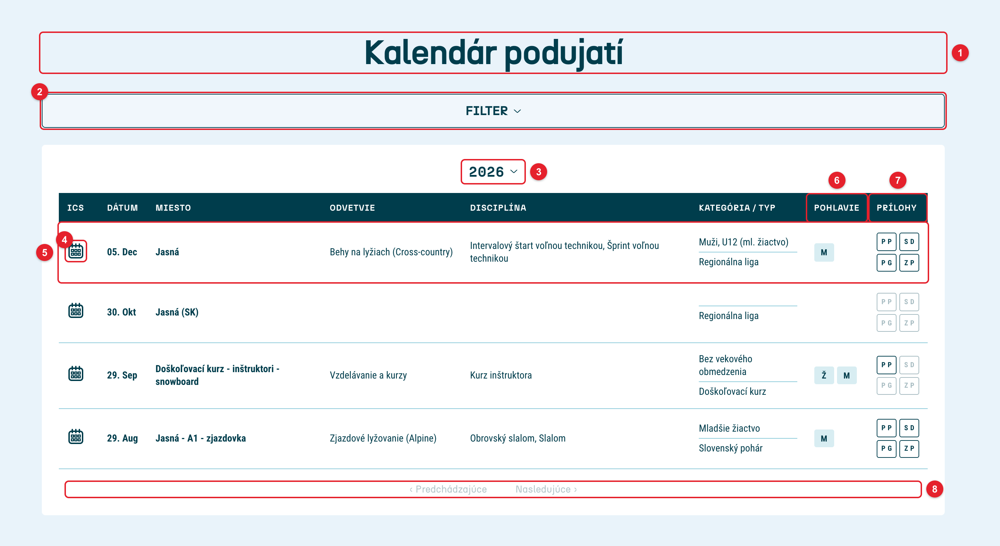

# screenshot-annotator (`shotmark`)

Screenshoty ľubovoľného webu do návodov a príručiek. Prvky na stránke označí červenými rámčekmi s číslami 1, 2, 3…, obrázok oreže a uloží. Čo sa má fotiť a označiť, sa raz popíše v konfigurácii – keď sa web zmení, všetky obrázky sa prerobia jedným príkazom.

Ku každému obrázku vie vytvoriť aj textový súbor s očíslovaným popisom, ktorý sa vloží do Wordu ako číslovaný zoznam.

Funguje na akomkoľvek webe aj lokálnom HTML súbore: bežné stránky, SPA aplikácie, shadow DOM (web komponenty), iframy, stránky za prihlásením aj za HTTP basic auth.

## Požiadavky

- Node.js 20 alebo novší
- Google Chrome (prípadne iný Chromium prehliadač, pozri `browserPath`)

## Inštalácia

```bash
git clone git@github.com:mdomdo0/screenshot-annotator.git
cd screenshot-annotator
npm install
npm link
```

`npm link` sprístupní príkaz `shotmark` v ľubovoľnom priečinku. Bez neho sa dá spúšťať cez `node /cesta/k/screenshot-annotator/bin/shotmark.mjs`.

## Vyskúšanie

```bash
npm run example        # lokálna ukážková stránka, bez internetu
npm run example:web    # verejný web (Wikipédia)
npm run example:zsl    # kalendár ZSL (pozri nižšie)
```

Výsledky sú v `examples/out/`.

## Ukážka: kalendár podujatí ZSL

Kompletná konfigurácia pre príručku kalendára podujatí ZSL je v [examples/zsl.config.mjs](examples/zsl.config.mjs). Vytvorí 15 obrázkov – 7 z administrácie a 8 z webu (zoznam, filter, rozbaľovací zoznam, nápoveda pri prílohách, detail podujatia, sťahovanie súborov, mobil a kalendár vložený na inú stránku).



Spustenie (web musí bežať na adrese z `baseUrl`, predvolene lokálny DDEV):

```bash
shotmark login -c examples/zsl.config.mjs
npm run example:zsl
```

`shotmark login` stačí raz – otvorí sa prehliadač, prihlásiš sa do WordPress administrácie a v termináli stlačíš Enter. Obrázky sú v `examples/out/zsl/`, pri každom je `.txt` s očíslovaným popisom, napr.:

```text
1. Nadpis
2. Filter
3. Rok
4. ICS
5. Riadok podujatia
6. Pohlavie
7. Prílohy
8. Stránkovanie
```

Čo sa v konfigurácii dá pozrieť ako vzor:

- `hide` – skrytie cookie lišty na všetkých obrázkoch,
- `eval` kroky – skrytie upozornenia témy a karty, ktorá do príručky nepatrí,
- `viewport` pri screenshote – iná veľkosť okna (administrácia, mobil),
- `clip` ako súradnice, selektor aj pole selektorov (filter + rozbalený zoznam pod ním),
- `frame` – značka vo vnútri iframe (blokový editor WordPress),
- `dismiss` – zatvorenie uvítacích okien editora a BeBuildera,
- `text`, `role` a `closest` – hľadanie prvkov podľa nápisu, prístupnosti a nadradeného prvku,
- pomocné funkcie `admin()` a `adminTab()` – konfigurácia je JavaScript, opakujúce sa časti sa dajú vytiahnuť do funkcií.

## Použitie

V priečinku, kde majú vzniknúť obrázky:

```bash
shotmark init
```

Vytvorí `shots.config.mjs`. V ňom nastav `baseUrl` a zoznam screenshotov.

Ak treba fotiť časť webu za prihlásením, raz sa prihlás:

```bash
shotmark login
shotmark login --url /admin/login
```

Otvorí sa okno prehliadača, prihlás sa ako zvyčajne a v termináli stlač Enter. Prihlásenie sa uloží do `auth.json` – tento súbor nikomu neposielaj a nedávaj do gitu. Keď prihlásenie vyprší, spusti `shotmark login` znova.

Vytvorenie screenshotov:

```bash
shotmark
shotmark --only uvodna-stranka,formular
shotmark -c dokumentacia/navod.config.mjs
```

Obrázky sa uložia do `out/` vedľa konfigurácie. Na konci sa vypíše súhrn – ak sa niektorý prvok nenašiel, je uvedený a obrázok sa vytvorí bez neho.

## Konfigurácia

```js
export default {
	baseUrl: 'https://www.example.com',
	hide: ['#cookie-banner'],
	shots: [
		{
			name: 'nastavenia',
			url: '/settings',
			auth: true,
			steps: [{ click: 'text=Rozšírené', wait: 300 }],
			clip: 'main',
			marks: [
				{ el: '#email', label: 'E-mail' },
				{ role: 'checkbox', name: 'Newsletter', label: 'Prihlásenie na newsletter' },
				{ text: 'Uložiť', pos: 'bottom', label: 'Uloženie' },
			],
		},
	],
};
```

Konfigurácia je JavaScript, takže sa dajú použiť premenné, funkcie aj `process.env` (napr. heslo pre basic auth mimo súboru).

### Celková konfigurácia

| Kľúč                | Predvolené                     | Význam                                                                  |
| ------------------- | ------------------------------ | ----------------------------------------------------------------------- |
| `baseUrl`           | –                              | adresa webu (povinné); môže byť aj cesta k priečinku s HTML, napr. `./site/` |
| `viewport`          | `{ width: 1440, height: 900 }` | veľkosť okna prehliadača                                                |
| `scale`             | `2`                            | ostrosť obrázka (2 = retina)                                            |
| `format`            | `png`                          | `png` alebo `jpg`                                                       |
| `outDir`            | `out`                          | priečinok pre obrázky (relatívne ku konfigurácii)                       |
| `hide`              | `[]`                           | CSS selektory skryté na všetkých screenshotoch (cookie lišta, chat…)    |
| `css`               | –                              | vlastné CSS vložené do každej stránky                                   |
| `loginUrl`          | `/`                            | stránka pre `shotmark login`                                            |
| `auth`              | `auth.json`                    | súbor s uloženým prihlásením                                            |
| `context`           | `{}`                           | ďalšie nastavenia prehliadača: `locale`, `colorScheme`, `httpCredentials`, `userAgent`, `extraHTTPHeaders`… |
| `waitUntil`         | `load`                         | kedy je stránka načítaná: `load`, `domcontentloaded`, `networkidle`     |
| `settle`            | `5000`                         | max. čakanie (ms), kým stránka dotiahne dáta                            |
| `timeout`           | `3000`                         | max. čakanie (ms) na prvok značky                                       |
| `preload`           | `false`                        | prejsť stránku odhora nadol, aby sa načítali lazy-load obrázky          |
| `padding`           | `40`                           | okraj okolo orezanej oblasti v px                                       |
| `style`             | červená                        | `{ color, border, pad, badge, radius, gap }` – vzhľad značiek           |
| `browserPath`       | –                              | cesta k prehliadaču, ak nie je nainštalovaný Chrome                     |
| `ignoreHTTPSErrors` | `true`                         | povolí weby s neplatným certifikátom (lokálny vývoj)                    |

Web za HTTP basic auth:

```js
context: { httpCredentials: { username: 'dev', password: process.env.DEV_PASSWORD } },
```

### Jeden screenshot (`shots[]`)

| Kľúč       | Význam                                                                         |
| ---------- | ------------------------------------------------------------------------------ |
| `name`     | názov výsledného súboru                                                        |
| `url`      | adresa stránky (relatívna k `baseUrl`)                                         |
| `auth`     | `true` = použiť uložené prihlásenie                                            |
| `viewport` | iná veľkosť okna len pre tento screenshot, napr. `{ width: 390, height: 844 }` (mobil) |
| `steps`    | kroky pred odfotením (pozri nižšie)                                            |
| `hide`     | ďalšie skryté prvky len pre tento screenshot                                   |
| `css`      | vlastné CSS len pre tento screenshot                                           |
| `preload`  | ako `preload` vyššie, len pre tento screenshot                                 |
| `clip`     | čo sa má odfotiť (pozri nižšie)                                                |
| `padding`  | okraj okolo oblasti pre tento screenshot                                       |
| `marks`    | značky – číslujú sa v poradí, v akom sú zapísané                               |

`clip` môže byť:

- `'viewport'` – viditeľná časť okna (predvolené),
- `'full'` – celá stránka,
- CSS selektor alebo objekt ako pri značke (`{ el, frame, within, … }`) – oblasť prvku,
- `{ x, y, width, height }` – presné súradnice,
- pole predchádzajúcich – spojí oblasti (napr. formulár aj rozbalený zoznam pod ním).

Oblasť sa automaticky zväčší tak, aby žiadna značka nebola orezaná.

### Kroky (`steps`)

Vykonajú sa postupne. Selektory môžu byť CSS aj Playwright (`text=Uložiť`, `role=button[name="Uložiť"]`).

| Krok                            | Čo urobí                                      |
| ------------------------------- | --------------------------------------------- |
| `{ click: 'selektor' }`         | klikne na prvok                               |
| `{ dblclick: 'selektor' }`      | dvojklik                                      |
| `{ hover: 'selektor' }`         | nabehne myšou (napr. na zobrazenie nápovedy)  |
| `{ fill: 'selektor', value }`   | vyplní pole                                   |
| `{ select: 'selektor', value }` | vyberie hodnotu v `<select>`                  |
| `{ check: 'selektor' }`         | zaškrtne checkbox                             |
| `{ press: 'Escape' }`           | stlačí kláves                                 |
| `{ waitFor: 'selektor' }`       | počká, kým sa prvok zobrazí                   |
| `{ scrollTo: 'selektor' }`      | posunie stránku k prvku                       |
| `{ goto: '/iná-stránka' }`      | prejde na inú adresu                          |
| `{ dismiss: 'text' }`           | zavrie vyskakovacie okno, ktoré obsahuje text |
| `{ eval: 'js kód' }`            | spustí JavaScript na stránke                  |
| `wait: 300`                     | (k ľubovoľnému kroku) počká daný počet ms     |

### Jedna značka (`marks[]`)

Prvok sa dá nájsť jedným z týchto spôsobov:

| Kľúč            | Príklad                                         |
| --------------- | ----------------------------------------------- |
| `el`            | `'#email'`, `'.menu > li'`, `'text=Ďalej'`, `'xpath=//h2'` |
| `text`          | `'Uložiť'` – presný text (funguje aj na tlačidlá `<input>`), `exact: false` = časť textu |
| `role` + `name` | `{ role: 'button', name: 'Uložiť' }` – podľa prístupnosti (button, link, tab, checkbox, textbox…) |

Doplnkové voľby:

| Kľúč      | Význam                                                                     |
| --------- | -------------------------------------------------------------------------- |
| `within`  | hľadať len vnútri tohto prvku                                              |
| `frame`   | prvok je vnútri iframe, napr. `'iframe[name="editor"]'`                    |
| `nth`     | ktorý z nájdených viditeľných prvkov, od 0                                 |
| `closest` | označiť nadradený prvok, napr. `'tr'`, `'li'`, `'.card'`                   |
| `pos`     | umiestnenie čísla: `right` (predvolené), `left`, `top`, `bottom`, `corner` |
| `pad`     | odsadenie rámčeka od prvku v px                                            |
| `n`       | vlastné číslo namiesto automatického                                       |
| `label`   | popis do súboru `<name>.txt`                                               |

Prvky v shadow DOM (web komponenty) sa hľadajú automaticky, netreba nič nastavovať.

## Tipy

- Selektory najjednoduchšie zistíš v Chrome: pravý klik na prvok → Preskúmať → pravý klik v DevTools → Copy → Copy selector.
- Keď stránka mení obsah (napr. nové dáta), poradie riadkov sa môže posunúť – pri tabuľkách je spoľahlivejšie hľadať podľa textu (`text`) než podľa `nth`.
- Ak sa značka nenájde, skús zvýšiť `timeout` alebo pridať krok `{ waitFor: '…' }`.
